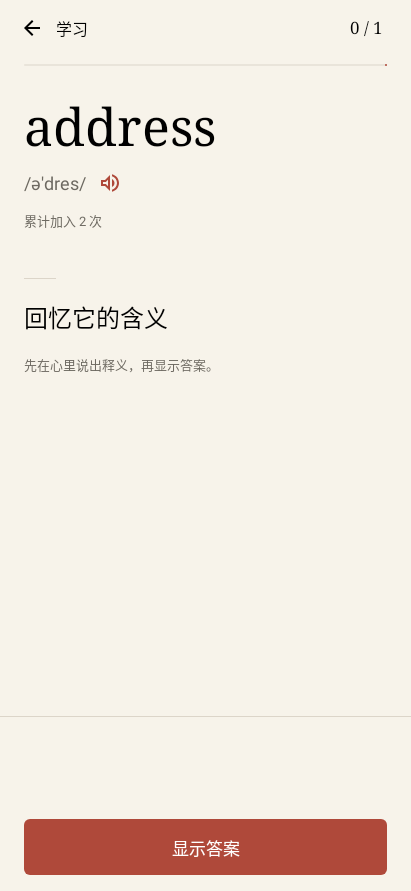
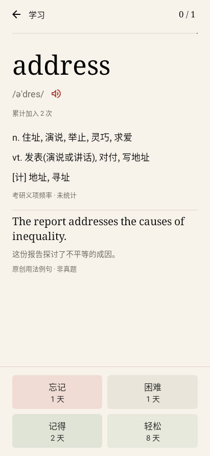

# 拾词

面向 Android 16 的原生离线查词和背词应用。重点是主动回忆、独立学习任务和可解释的复习安排；暂不做澎湃 OS 专项适配。

**安装下载：[v0.4.0 Release](https://github.com/CloudcoreZZH/shici-android/releases/tag/v0.4.0)**。使用原签名，可直接覆盖安装 0.1.0 / 0.2.0 / 0.3.0。

[升级与使用说明](docs/releases/0.4.0/升级与使用说明.md) · [验证报告](docs/releases/0.4.0/验证报告.json) · [墨白书页与流畅度](docs/0.4.0-墨白书页与流畅度.md) · [免费词典质检](docs/免费词典质检与接入.md)

77 项自动化测试通过，发布检查无错误。覆盖按天调度、重复加入、遗忘等待、撤销、进度恢复、旧版迁移、真实词典检索和来源展示，以及义项证据校验与排序、长列表按需呈现、固定揭晓布局、帧耗时汇总、横屏、大字号和深色界面；目标手机的实际表现仍需真机验收。本机构建交付位于 `dist/`，APK 通过 GitHub Release 分发，开发工具、缓存和签名私钥不提交到仓库。

**尚未完成：2027 英语（一）完整大纲核验、真实义项频率数据填充及全部中文释义的专业审校。当前经核验的义项频率覆盖 0 词，缺数据标「未统计」。** 已选择免费可信资料，未用旧年份词表或混合考试单词频数替代这些要求。

## 界面

以下为 Android 16 测试环境的实际渲染，尚非小米真机截图。

| 学习首页 | 主动回忆 | 揭晓与评分 |
|---|---|---|
|  |  |  |

## 功能

- 可离线检索 778,580 个词：保留 ECDICT 768,739 词原始中文释义、英文释义、音标和词形；新增 33,998 词的维基补充释义，其中 9,841 个原词库缺失词可查可学。补充资料不保证具备音标或英文释义。
- “全部释义”可展开维基参考，保留原文简繁、词性、用法标签和来源。NETEM 2024 参考词表仅用于成员对照；许可和署名可在应用内离线查看。
- 多个自建词书。同一单词每次加入产生独立学习任务，累计加入次数永久保留至用户主动删除。
- 每组 5 / 10 / 20 词，重复加入的同词任务分配到后续组。忘记不会完成学习任务，会按间隔再巩固。
- 学习和复习独立；FSRS-6 按答题记录更新记忆状态，间隔为整数天，到期当天随时可学；已到期词按加入次数从高到低排列。首页展示未来 7 天复习日历。
- 揭晓前隐藏中文答案，评分展示预计间隔，支持撤销上一条。中断后恢复剩余组，事务和幂等检查防止重复计分。
- 墨白书页设计，浅色、深色和跟随系统；衬线词头、平面列表和固定评分区域。边到边布局、预测性返回、短淡入淡出，长释义懒加载。Compose 原生 120 Hz 绘制投票；「我的」可手动记录 60 秒本机帧耗时，无上传、无后台采集。实际流畅度需真机复测。
- 使用手机已有的离线英语 TTS 语音。

**仅真实义项频率参加排序；缺数据的词标「未统计」。** 次数必须来自同一英语（一）语料内的逐次义项记录，显示考试范围和可核对出处；编辑优先级、通用词频、混合考试单词次数不参与。当前可分发的已核验记录为 0，默认保留原词典顺序。120 条原创双语用法例句仍可使用，明确标注非真题。见 [义项数据规范与来源核查](docs/考研义项频率数据规范.md)。

## 工程组织

| 目录 | 职责 |
|---|---|
| `core/` | 纯 Kotlin 模型、FSRS-6、复习排序、学习组状态及单元测试 |
| `app/.../data/` | 只读词典和个人学习数据库；SQL 和事务边界 |
| `app/.../ui/` | 不同页面、状态与 ViewModel；界面不直接执行 SQL |
| `app/.../audio/` | 系统离线 TTS 的生命周期 |
| `app/.../performance/` | 用户主动开启的有界本机帧耗时记录 |
| `scripts/` | 已批准的本地工具准备、词库转换和构建脚本 |
| `docs/` | 设计决策、权限/存储清单与验收说明 |

采用 Android 自带 SQLite，不引入 ORM 代码生成器。原词典、补充词典和个人数据库相互独立；个人库按版本迁移，不提供破坏性降级或自动清空数据库的捷径。数据实体通过显式映射读写，不依赖反射序列化。

## 本机构建

所有命令在当前工程目录执行。Python 使用指定的 NLP 环境，Java 使用项目内完整 OpenJDK 21；已有 PyCharm JBR 缺少 jlink，不能完成 Android 打包。

```powershell
& 'D:\anaconda3\envs\NLP\python.exe' .\scripts\bootstrap.py
& 'D:\anaconda3\envs\NLP\python.exe' .\scripts\prepare_jdk.py
& 'D:\anaconda3\envs\NLP\python.exe' .\scripts\prepare_dictionary.py
& 'D:\anaconda3\envs\NLP\python.exe' .\scripts\fetch_open_dictionary.py --download-approved
& 'D:\anaconda3\envs\NLP\python.exe' .\scripts\prepare_references.py
.\scripts\build.ps1
```

下载命令必须先得到用户对范围的授权。此次会话已授权必要构建工具、完整 JDK、ECDICT，以及不超过 85 MB 的两类免费资料。`prepare_references.py` 完全离线，校验原件哈希、过滤并生成附带来源许可的补充数据库。后续增加模拟器、NDK、模型、其他词库或超过预算的下载需要另行申请。

构建缓存保存于 `.cache/`，工具保存于 `.tooling/`，下载原件保存于 `.downloads/`；不修改系统 PATH 或已有 Java/Python 环境。依赖齐全后可用 `scripts/build.ps1 -Offline`。

构建脚本用临时盘符指向当前目录，规避 Java 在 Windows 上解析中文参数文件路径的问题；文件没有搬动，退出时自动撤销盘符。正式 APK 使用 `.signing/` 内的本地签名身份，密码不放入源码或命令参数。请保留该目录用于后续覆盖升级，不要分享或提交版本库。

## 数据与卸载

应用没有网络、文件存储、通讯录、通知、无障碍、悬浮窗或开机启动权限。没有服务、广告、统计和崩溃上报 SDK。

词典安装副本位于应用私有 `noBackupFilesDir`；个人数据位于应用私有 databases；设置位于应用私有 shared preferences。关闭云备份和设备迁移备份。正常卸载时 Android 负责删除这些目录。没有自动写入 Downloads、Documents 或共享根目录的代码。

“清除个人学习数据”会删除全部词书、任务、记忆和答题记录并恢复空默认词书，保留随安装包提供的词典。首版未提供外部备份导出，卸载前请自行确认是否需要保留学习记录。

## 算法说明

FSRS-6 使用官方默认 21 个系数，按实际答题更新每个词的稳定性和难度。默认目标保持率 90%，可调 70–97%；取消分钟级步骤，计算间隔取整数天，最早次日、最长 36,500 天，到期日按手机本地日历零点计算。例如周一 23:55 的 1 天安排在周二，不要求等足 24 小时。新词默认四档为 1/1/2/8 天，后续动态计算。间隔随机扰动关闭，便于结果复现。

按天取整可能偏离目标保持率；这是用户选择的使用节奏，不代表已证明最优学习效率。旧版分钟安排会迁移，保留词书、加入计数和答题历史；升级前最后一次评分的撤销入口关闭，升级后新评分仍支持撤销。

目前没有训练个人系数的优化器；“个性化间隔”指记忆状态随每次答题更新，不能解释为已经在用户数据上训练过参数。加入次数属于队列排序规则，不修改 FSRS 的公式，不把加入行为伪造为答错记录。

数学依据：[FSRS 官方算法](https://github.com/open-spaced-repetition/awesome-fsrs/wiki/The-Algorithm)。状态转移参照：[py-fsrs](https://github.com/open-spaced-repetition/py-fsrs)。数据来源及许可见 [第三方资料说明](THIRD_PARTY_NOTICES.md) 与 APK 内许可全文。

## 尚需真机验收

预测性返回、键盘、离线 TTS、实际刷新率与流畅度、覆盖安装、进程恢复和卸载清理仍需要目标手机验证。横屏与较大字号已有 Android 16 测试环境验证，不等于所有手机均已实测。
